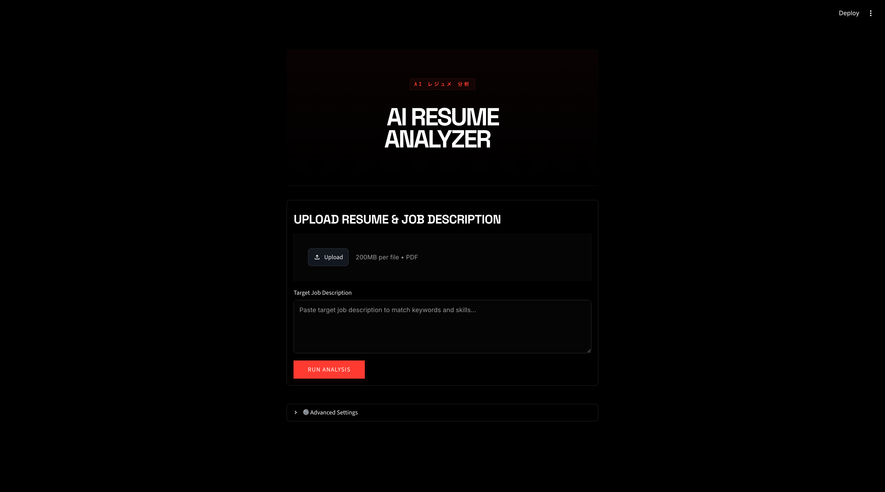
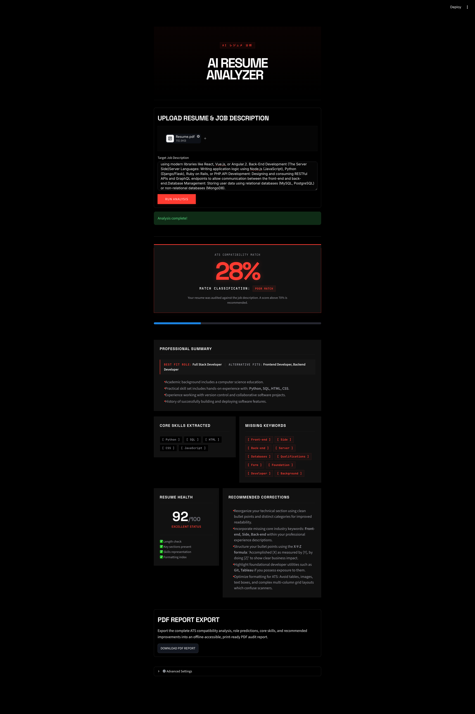

# AI Resume Analyzer

**Live Demo:** https://kaushal-ai-resume-analyzer.streamlit.app/

This is a resume analysis application that I built to improve my Python development skills and understand how Applicant Tracking Systems (ATS) evaluate resumes during the hiring process.

The idea behind the project was simple: create a platform where users can upload their resume, compare it against a job description, identify missing keywords, and receive practical suggestions to improve their chances of getting shortlisted.

While building this project, I learned how to work with PDF processing, Natural Language Processing (NLP), machine learning concepts, dashboard development, API integration, Git, GitHub, and cloud deployment.

---

## Features

### ATS Score Analysis

* Compare resumes against job descriptions
* Generate ATS compatibility scores
* Classify resumes as Poor, Average, or Strong matches

### Resume Parsing

* Upload resumes in PDF format
* Extract content from single and multi-page documents
* Automatically process resume text

### Skill Detection

* Identify technical skills from resume content
* Detect tools, technologies, and programming languages
* Present skills in a clean and readable format

### Missing Keyword Analysis

* Detect important keywords missing from the resume
* Improve ATS optimization
* Highlight areas that need improvement

### Role Prediction

* Suggest suitable career roles based on detected skills
* Recommend alternative career paths

### Resume Health Check

* Evaluate overall resume quality
* Analyze ATS readiness
* Review skill and keyword coverage

### Improvement Suggestions

* Generate actionable recommendations
* Help strengthen resume content
* Improve keyword relevance

### PDF Report Export

* Download a complete resume analysis report
* Save results for future reference

---

## Built With

* Python
* Streamlit
* Pandas
* NumPy
* Scikit-Learn
* ReportLab
* Google Gemini API (Optional)

## Project Screenshots

### Home Page

### Dashboard

## What I Learned

Some of the things I learned while building this project:

* Building interactive applications with Streamlit
* Working with PDF parsing and text extraction
* Implementing NLP-based keyword analysis
* Understanding ATS scoring concepts
* Generating downloadable PDF reports
* Integrating external AI APIs
* Structuring larger Python projects
* Managing code with Git and GitHub
* Deploying applications using Streamlit Cloud

---

## Future Improvements

There are still several features I would like to add:

* Resume section-by-section analysis
* Industry-specific ATS scoring
* Multiple resume comparison
* Interview preparation recommendations
* Resume benchmarking system
* AI-powered resume optimization

---

## About

This project is an important milestone in my journey of learning Python, Data Analytics, NLP, and AI-powered applications. It helped me understand how resume screening works while giving me hands-on experience building and deploying a complete end-to-end application.

---

## Author

**Kaushal**

Aspiring Python Developer and Data Analytics Enthusiast passionate about building practical applications, exploring AI-driven solutions, and continuously improving through hands-on projects.
